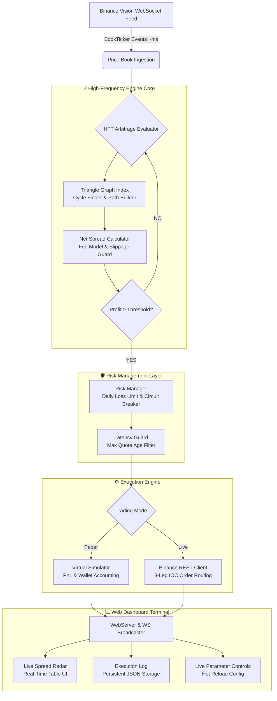

<div align="center">

# ⚡ KArbit HFT
### *High-Frequency Binance Triangular Arbitrage Engine & Web Terminal*

[](https://golang.org)
[](https://binance-docs.github.io/apidocs/spot/en/)
[](https://developer.mozilla.org/en-US/docs/Web/API/WebSockets_API)
[](#)
[](LICENSE)
[](https://karbit.npma.my.id)

*Engine arbitrase triangular berkecepatan tinggi (HFT) untuk Binance Spot Market. Mengevaluasi ribuan rute segitiga setiap detik menggunakan WebSocket real-time, dengan dashboard web interaktif untuk monitoring dan kendali penuh.*

---

</div>

## 📌 Ikhtisar Proyek / Overview

**KArbit** adalah mesin arbitrase triangular berbasis Go berkecepatan tinggi yang beroperasi di atas feed pasar real-time Binance melalui WebSocket. Engine ini secara otomatis menemukan dan mengevaluasi ribuan rute segitiga (`USDT → A → B → USDT`) setiap detik, menghitung spread bersih setelah biaya transaksi, dan mengeksekusi peluang yang melampaui threshold profit minimum.

Platform ini menyertakan **Web Terminal interaktif** yang menampilkan radar spread live, riwayat eksekusi persisten, diagram arsitektur rute, serta kendali parameter langsung tanpa perlu merestart engine.

---

## 🏛️ Arsitektur Sistem / Architecture Overview



---

## 🚀 Fitur Utama / Key Features

### 1. ⚡ High-Frequency Triangular Arbitrage Engine
- Mengevaluasi **ribuan rute segitiga per detik** dari feed BookTicker Binance real-time.
- Menghitung **Net Spread** setelah fee Binance (0.075% / 0.05% dengan BNB discount) dan estimasi slippage.
- Formula: `Final USDT = Modal × (1 - Fee)³ × Rate₁ × Rate₂ × Rate₃`
- Mendukung hingga **1,000+ triangular paths** aktif secara paralel.

### 2. 📡 Real-Time Spread Radar
- Tabel live yang menampilkan top rute berdasarkan gross spread terbesar.
- Filter tab: **All Routes** | **⚡ Triggered** (melampaui threshold) | **📊 Monitoring** (aktif dipantau).
- Quote age indicator: memastikan harga yang dievaluasi tidak stale.

### 3. 🛡️ Manajemen Risiko Berlapis
- **Circuit Breaker**: Menghentikan eksekusi otomatis saat batas kerugian harian tercapai.
- **Latency Guard**: Memfilter peluang dengan quote age melebihi batas latensi konfigurasi.
- **Slippage Tolerance**: Menolak eksekusi jika estimasi slippage terlalu tinggi.
- **Cooldown Timer**: 100ms cooldown antar-eksekusi untuk mencegah double-firing.

### 4. 📋 Persistent Execution Log
- Semua riwayat transaksi otomatis disimpan ke **`logs/executions.json`**.
- Data **tidak hilang saat restart** — engine memuat ulang log dari disk setiap kali dijalankan.
- Maks 50 entri terbaru tersimpan secara rolling.

### 5. ⚙️ Live Parameter Controls (Hot Reload)
- Ubah kapital per trade, threshold profit, fee rate, slippage, dan batas risiko **tanpa restart**.
- Switch mode **Paper Simulation ↔ Live Binance** secara real-time melalui UI.
- Verifikasi API Key Binance langsung dari modal dashboard.

### 6. 🏆 Top Arbitraged Pairs Bar Chart
- Visualisasi diagram batang horizontal ranking pasangan segitiga yang paling sering profit.
- Menampilkan jumlah win dan total PnL per kombinasi pasangan.

---

## 📁 Struktur Direktori / Project Structure

```
KArbit/
├── cmd/
│   └── karbit/
│       └── main.go               # Entry point — engine orchestration
├── config/
│   └── config.go                 # Config schema & loader
├── internal/
│   ├── engine/
│   │   ├── arb_evaluator.go      # Triangle spread evaluator (HFT core)
│   │   ├── executor.go           # Paper & Live execution + persistence
│   │   ├── latency_guard.go      # Quote age / latency filter
│   │   └── price_book.go         # In-memory order book state
│   ├── exchange/
│   │   ├── binance_client.go     # Binance REST API (orders, account)
│   │   ├── websocket.go          # Binance BookTicker WS feed
│   │   └── types.go              # Order types & request structs
│   ├── graph/
│   │   ├── cycle_finder.go       # Triangular path discovery algorithm
│   │   └── triangle.go           # Triangle & leg data structures
│   ├── risk/
│   │   ├── fee_model.go          # Fee & BNB discount calculation
│   │   └── limits.go             # Risk limits & circuit breaker
│   └── ui/
│       ├── web_server.go         # HTTP/WebSocket dashboard server
│       └── terminal_tui.go       # CLI TUI display (optional)
├── web/
│   ├── index.html                # Dashboard terminal UI
│   ├── style.css                 # Dark neon HFT terminal theme
│   ├── app.js                    # Real-time WebSocket client & rendering
│   └── logo.jpg                  # KArbit brand logo
├── logs/
│   └── executions.json           # Persisted execution log (auto-saved)
├── config.json                   # Runtime configuration
├── ecosystem.config.js           # PM2 process manager config
└── go.mod
```

---

## ⚙️ Konfigurasi / Configuration

Edit `config.json` untuk mengatur parameter engine:

```json
{
  "base_currency": "USDT",
  "trading_mode": "paper",
  "trade_amount_usdt": 100,
  "min_profit_percent": 0.05,
  "fee_rate": 0.00075,
  "use_bnb_discount": true,
  "max_latency_ms": 200,
  "max_slippage_tolerance": 0.001,
  "max_daily_loss_usdt": 50,
  "max_tracked_triangles": 1000,
  "radar_display_limit": 100,
  "worker_count": 8,
  "web_port": 8080
}
```

| Parameter | Keterangan |
|---|---|
| `trading_mode` | `paper` (simulasi) atau `live` (eksekusi nyata) |
| `trade_amount_usdt` | Modal per siklus arbitrase (USDT) |
| `min_profit_percent` | Threshold profit minimum untuk trigger eksekusi |
| `max_tracked_triangles` | Jumlah rute segitiga yang dipantau engine |
| `radar_display_limit` | Jumlah rute yang ditampilkan di tabel UI |
| `fee_rate` | Fee Binance (0.00075 = 0.075%, atau 0.0005 dengan BNB) |

---

## 🚦 Cara Menjalankan / Getting Started

### Prerequisites
- Go 1.21+
- PM2 (`npm install -g pm2`) — opsional, untuk production

### 1. Clone & Build
```bash
git clone https://github.com/NPMA7/KArbit.git
cd KArbit
go build -ldflags="-s -w" -o karbit ./cmd/karbit
```

### 2. Konfigurasi
```bash
cp config.json.example config.json   # Sesuaikan parameter
# Edit config.json sesuai kebutuhan
```

### 3. Jalankan (Development)
```bash
./karbit
```

Dashboard tersedia di: **`http://localhost:8080`**

### 4. Jalankan dengan PM2 (Production)
```bash
pm2 start ecosystem.config.js
pm2 save
pm2 startup
```

---

## 🔑 Mode Live Trading

Untuk mengaktifkan Live Trading dengan Binance:

1. Buka dashboard → klik **"Live Binance"**
2. Masukkan **Binance API Key** & **API Secret**
3. Klik **"Verify & Activate Live"** — engine akan memverifikasi akun dan saldo
4. Engine otomatis beralih ke mode eksekusi order nyata

> ⚠️ **Peringatan**: Mode Live akan mengeksekusi order nyata di akun Binance Anda. Pastikan Anda memahami risiko trading sebelum mengaktifkan mode ini. Gunakan API Key dengan permission **Spot Trading Only** (tanpa withdrawal).

---

## 📊 Live Demo

Dashboard live tersedia di: **[karbit.npma.my.id](https://karbit.npma.my.id)**

---

## 📄 Lisensi / License

MIT License — bebas digunakan, dimodifikasi, dan didistribusikan.

---

<div align="center">

Built with ⚡ Go + WebSocket | Powered by Binance Public Market Data

</div>
